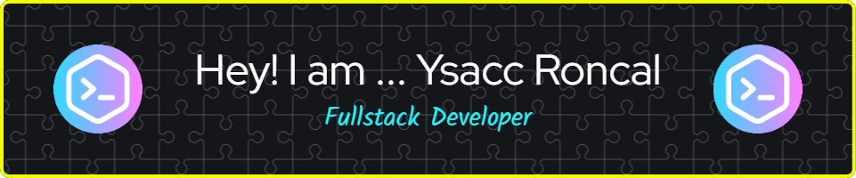

<hr>
<p align="center"></p>

<!-- https://github-readme-stats.vercel-app/api?username=ysacc


[](https://www.linkedin.com/in/ysacc-roncal-6889aa173/) -->

I'm a Self Taught Developer and Full Stack Developer  🙌🏼 
Full stack developer with +2 years of experience in Front End, involved in the entire software development life cycle.
My expertise includes finding IT solutions for public and private organizations in JavaScript, ReactJs, Python and Flutter.
I am passionate about technology and innovation, in constant search of new challenges to continue growing professionally and be able to apply it day by day.

About Me:
- 🎓studying more programming languages
- :test_tube: Taking the Full Stack Developer bootcamp
- 🪐 starting more projects
- :speech_balloon: Ask me about accessibility, cybersecurity, full-stack, web, or literally anything!
- :mailbox: You can reach me with the links below

<hr>
Contact Me:

[](https://www.linkedin.com/in/ysacc-roncal/)
[](https://github.com/ysacc) 
[](https://www.instagram.com/)
[](mailto:samironcal@gmail.com)
[](https://drive.google.com/file/d/1z9Ewe9R_evpD9GgFih6wGETmYMZVP2_z/view?usp=share_link)
https://developers.google.com/profile/badges/events/io/2023/attendee

<hr>
Languages I use


<hr>
 Some of the technologies I have worked with


<hr>
 Some of my favorite open source projects

[](https://github.com/bitwarden)
[](https://github.com/darkreader/darkreader)
[](https://github.com/gorhill/uBlock)
[](ttps://github.com/meganz/)
[](https://github.com/microsoft/vscode)
[](https://www.torproject.org/)

<!-- <br>

<br> -->
<hr>
 Fun fact: I once solved the world's oldest question with a single line of JavaScript
<!-- wi*quL3fcV -->

```javascript
// Which came first: the chicken or the egg?
console.log(['🥚', '🐣', '🐥', '🐔'].sort())

>>> [ '🐔', '🐣', '🐥', '🥚' ]
```
<hr>
<p>
  
  <p>
    
    <a href="https://www.google.com/"></a>
    <a href="https://github.com/ysacc/"></a>
    <a href="https://github.com/ysacc?tab=repositories"></a>
    <a href="https://github.com/ysacc/badges"></a>
    <a href="mailto:samironcal@gmail.com?subject=[GitHub]%20🔥%20Prise%20de%20contact&body=Bonjour%20Stan%2C%0A%0AJe%20viens%20vers%20toi%20aujourd%27hui%20apr%C3%A8s%20avoir%20vu%20ton%20profil%20GitHub%20pour%20..."></a>
    <a href="https://twitch.tv/ysacc"></a>
    
    
    
    
    
    
    
  </p>
</p><br/><br/>

<hr>
<h2 align="center">THANKS FOR YOUR VISIT !!!<h2>
<!--  -->


<!--
**ysacc/ysacc** is a ✨ _special_ ✨ repository because its `README.md` (this file) appears on your GitHub profile.

Here are some ideas to get you started:

- 🔭 I’m currently working on ...
- 🌱 I’m currently learning ...
- 👯 I’m looking to collaborate on ...
- 🤔 I’m looking for help with ...
- 💬 Ask me about ...
- 📫 How to reach me: ...
- 😄 Pronouns: ...
- ⚡ Fun fact: ...
-->
