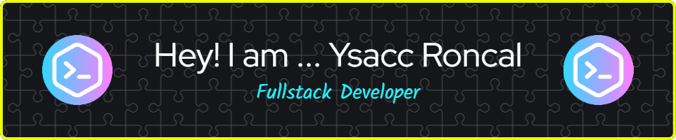

<!-- ================= PROFILE README - YSACC ================= -->

  

<h1 align="center">Ysacc Roncal 👨‍💻</h1>

  Senior Full-Stack Developer (React / Next.js / TypeScript / Node.js / AWS)

  7+ years building scalable web applications for enterprise teams.

  
  
  

<h2>🌐 Professional Website</h2>

  👉 <strong><a href="https://ysaccroncal.dev">https://ysaccroncal.dev</a></strong>

On my website you’ll find:

<ul>
  <li>📌 Updated Resume</li>
  <li>🚀 Enterprise & Product Projects</li>
  <li>📊 Professional Experience</li>
  <li>📬 Contact information</li>
</ul>

<h2>👨‍💻 About Me</h2>

  I’m a <strong>Senior Full-Stack Developer & Technical Lead</strong> with
  7+ years of experience delivering high-impact digital products for banking,
  enterprise, and SaaS environments.

I specialize in:

<ul>
  <li>Scalable Frontend Architectures with React, Next.js, and Vue</li>
  <li>Type-safe backend services with Node.js and TypeScript</li>
  <li>Cloud-native solutions with AWS</li>
  <li>CI/CD automation and clean code practices</li>
  <li>Leading development teams of 3–8 developers</li>
</ul>

  I’ve contributed to enterprise-level solutions for financial and corporate
  environments, building products from MVP to production scale.

<h2>🚀 Featured Projects</h2>

<h3>🏦 Interbank – Investment Platform</h3>

Modern financial product platform.

<ul>
  <li>React / Angular / Flutter</li>
  <li>Enterprise frontend architecture</li>
  <li>Agile development</li>
</ul>

<h3>💼 ERP – Supermercados Peruanos</h3>

Internal enterprise management system.

<ul>
  <li>React / Node.js / MySQL</li>
  <li>Performance optimization</li>
  <li>Modular architecture</li>
</ul>

<h3>🎓 Silbia – UTP Syllabus Management System</h3>

Academic management platform.

<ul>
  <li>Next.js / TypeScript</li>
  <li>REST APIs integration</li>
  <li>Clean UI architecture</li>
</ul>

<h3>🌍 Corporate Websites & SaaS Products</h3>

Multiple production-ready web platforms using:

<ul>
  <li>Next.js</li>
  <li>React</li>
  <li>Tailwind CSS</li>
  <li>AWS</li>
  <li>CI/CD pipelines</li>
</ul>

  🔗 View complete case studies:
   
  👉 <a href="https://ysaccroncal.dev/projects">https://ysaccroncal.dev/projects</a>

<h2>🛠 Tech Stack</h2>

<h3>Frontend</h3>

  
  
  
  
  

<h3>Backend</h3>

  
  
  

<h3>Cloud & DevOps</h3>

  
  
  
  

<h2>🧩 Architecture & Engineering</h2>

  I design and implement maintainable software architectures focused on
  scalability, modularity, performance, and long-term product evolution.

<ul>
  <li>Microfrontend architectures with Module Federation</li>
  <li>Domain-Driven Design and Hexagonal Architecture</li>
  <li>SOLID principles and Clean Architecture</li>
  <li>Reusable component libraries and Design Systems</li>
  <li>REST API and microservices integration</li>
  <li>Real-time applications with Firebase and WebSockets</li>
  <li>Performance optimization and technical debt reduction</li>
  <li>Automated testing and continuous delivery practices</li>
</ul>

<h2>🏗 Technical Leadership</h2>

  As a <strong>Technical Lead</strong>, I have participated in architecture
  definition, technical planning, code reviews, and coordination of
  development teams.

<ul>
  <li>Technical guidance for frontend and full-stack teams</li>
  <li>Architecture decisions and proof-of-concept development</li>
  <li>Code quality standards and development conventions</li>
  <li>Task estimation and technical roadmap planning</li>
  <li>Pull request reviews and developer mentoring</li>
  <li>Collaboration with Product, UX/UI, QA, DevOps, and Backend teams</li>
  <li>Enterprise application modernization and migration strategies</li>
</ul>

<h2>⚡ Microfrontends & Modern Frontend</h2>

  I have experience building independently deployable frontend modules and
  integrating them into enterprise host applications.

<ul>
  <li>React and TypeScript microfrontends</li>
  <li>Vite Module Federation</li>
  <li>Shared dependencies and singleton configuration</li>
  <li>Remote component lazy loading</li>
  <li>Cross-application authentication</li>
  <li>Design System integration</li>
  <li>Independent CI/CD pipelines</li>
  <li>Runtime configuration and environment management</li>
</ul>

<h2>☁️ Cloud & Backend Experience</h2>

I have developed and integrated cloud-native solutions using:

<ul>
  <li>AWS Lambda</li>
  <li>Amazon API Gateway</li>
  <li>Amazon S3</li>
  <li>Amazon CloudFront</li>
  <li>Amazon DynamoDB</li>
  <li>Amazon EKS</li>
  <li>Amazon SQS</li>
  <li>Amazon EventBridge</li>
  <li>Firebase Authentication</li>
  <li>Cloud Firestore</li>
  <li>PostgreSQL and Supabase</li>
</ul>

<h2>🧪 Quality & Testing</h2>

  I promote reliable delivery through testing, automation, and maintainable
  engineering practices.

<ul>
  <li>Unit and integration testing</li>
  <li>Jest, Vitest, and React Testing Library</li>
  <li>End-to-end testing with Playwright</li>
  <li>Type-safe development with TypeScript</li>
  <li>CI/CD validation pipelines</li>
  <li>Code reviews and static analysis</li>
  <li>Error monitoring and production diagnostics</li>
</ul>

<h2>🔧 Additional Technologies</h2>

  
  
  
  
  
  
  
  
  
  

<h2>📊 GitHub Stats</h2>

  
  

<h2>🌎 Languages</h2>

<ul>
  <li>Spanish — Native</li>
  <li>English — B1</li>
  <li>German — A1</li>
</ul>

<h2>📫 Open to Opportunities</h2>

I’m open to remote opportunities where I can contribute as:

<ul>
  <li>Senior Frontend Engineer</li>
  <li>Senior Full-Stack Developer</li>
  <li>Technical Lead</li>
  <li>Frontend Architect</li>
  <li>Software Architect</li>
</ul>

  I’m especially interested in enterprise platforms, fintech products, SaaS
  applications, cloud-native solutions, and modern frontend architecture.

<h3 align="center">Let’s build scalable products 🚀</h3>
